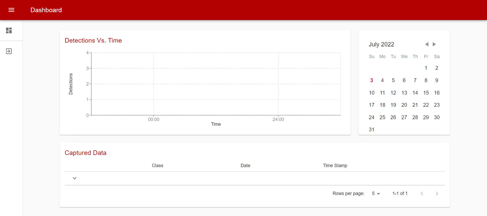
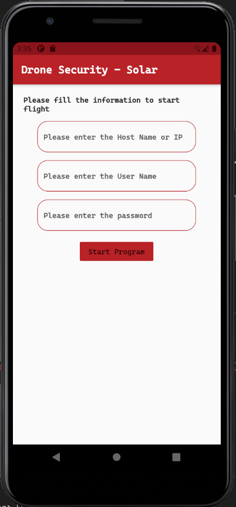
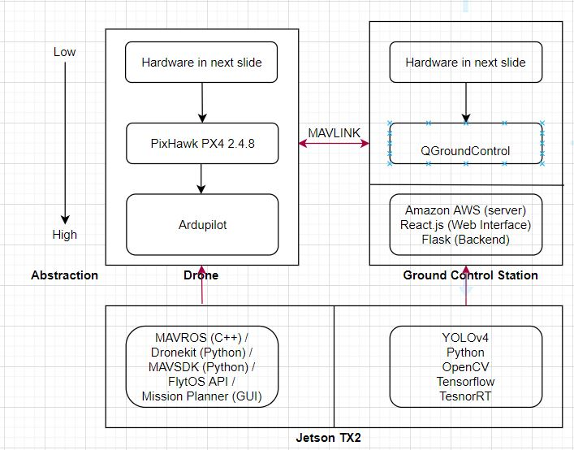

# smart-AI-autonomous-drone

A smart autonomous drone with Real-Time Object Detection capabilities.

This part of project focuses on building a drone from scratch then making it autonomous and making it smart using Nvidia Jetson TX2.

Full drone building instructions can be found [here](https://github.com/NVIDIA-AI-IOT/redtail/wiki/Skypad-TBS-Discovery-Setup).

This also has a React website to show real-time alerts and a Flutter App for initiating the flight.

**Demo of Custom Drone with real-time intruder detection:**

**Features of the Autonomous Drone:**

* The drone had a Pixhawk PX4 flight controller with Ardupilot as the flight controller software.
* If required it could be flied manually. It was very stable with +-2m while loitering.
* It was connected to a companion computer (Jetson TX2) which gave it the ability to process video stream real-time on the edge.
* It ran a YOLOv4 model for person detection.
* While flying autonomously it received the length and breadth of the area and it creates a flight plan on itself and surveys the area for intruder.
* If intruder is spotted it sends alert to the website.
* We used a RapberryPi Zero W connected to a RaspberryPi Cam v2 which pre-processed the frames and served it over HTTP.
* The Jetson TX2 listening the that stream started processing as soon it received the stream.

### **Demo of The Website:**

**Features of the Website:**

* The website was made with React.js and deployed on AWS.
* The website showed each alert with a alert tone under "Captured Data". Each data had:
  * image of the violation
  * class (in our case Person)timestamp
  * an active google map window with pin as the location of the drone while violation.
* It also had a chart which showed the number of violations against time on that day.
* One could even select a previous date to see old data, all dates with data available was marked.
* Basic login / logout features were also available.

### **Demo of The App:**

**Features of the App:**

* The app was developed using Flutter and its release APK was given to user team for ease of use of the drone while operation.
* After entering essential information as shown above it connected to the shell / terminal via SSH of the appropriate device in our case (Jetson TX2), the device should have SSH enabled.
* Once connected one can give the length, breadth and height for the area to be surveyed in meters.
* With little changes in the source code one can use it as a general purpose app to SSH into other devices.

### **Detailed Tech stack:**

**For getting started with firebase:** [https://yanwei-liu.medium.com/learning-firebase-1-create-your-first-project-b5b5e352198c](https://yanwei-liu.medium.com/learning-firebase-1-create-your-first-project-b5b5e352198c)
